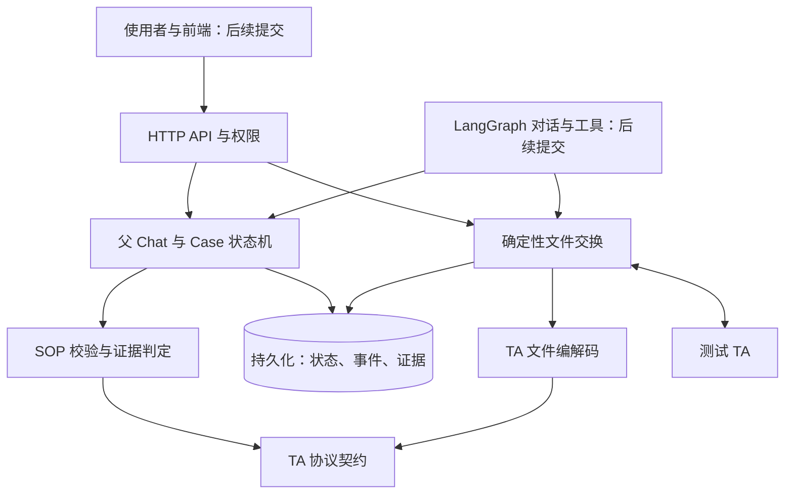

# Case 全流程设计

## 架构与提交顺序

每个 PR 只加入图中的一层及其直接验收。协议定义先于编解码，编解码先于文件服务；确定性的 Case 业务先于 Agent 接入。图表示目标架构，不表示所有模块已经合并。

## 当前合并状态

| 层 | 状态 | 下一层依赖它的原因 |
|---|---|---|
| TA 协议字段、业务代码与文件类别 | 前一 PR 待合并 | 编解码、申请校验和 SOP 需要共同的字段含义 |
| TA 文件编解码与版本配置 | 本 PR 提议合并 | 文件服务必须读写同一协议布局 |
| 数据库、身份与隔离 | 待提交 | 文件、Case 和 Agent 状态需要可信的持久化边界 |
| 申请、批次与回传归属 | 待提交 | Case 的证据必须来自真实的确定性流程 |
| SOP、Case 状态与人工处置 | 待提交 | Agent 必须遵守已确认的计划和状态门槛 |
| Agent 事件与 LangGraph 适配 | 待提交 | 在确定性业务之上提供提问、建议与执行协助 |
| 前端 | 待提交 | 呈现状态与操作；本轮不上传 |

## 第一个 PR 的边界：TA 协议契约

第一个 PR 仅定义当前测试流程用到的文件字段、顺序、类型、字节宽度、数值精度、业务代码、必填元数据和交换方向。01、03 是销售侧发往 TA 的申请；02、04、05 是 TA 回传。2.2 布局分别有 89、27、82、122、23 个字段；07 基金资料有 86 个字段。这里的“必填”是协议与业务元数据，不能代替后续发送端对具体申请的校验。

第一个 PR 不生成文件、不写数据库、不运行 Case 状态机，也不调用模型。第二个 PR 加入编解码与完整文件往返验证；它直接读取第一个 PR 的定义，避免在服务层另写一套字段清单。

## 第二个 PR：编解码与版本配置

本 PR 叠在协议定义 PR 之上，加入 2.1／2.2 文件结构、GB18030 字节处理、定长字段编解码、数据文件与索引文件的构造、解析与检查，以及按业务含义归一化返回记录。它仍然只是纯文件处理模块，不连接数据库，也不发送或接收网络请求。

验收以真实字节长度、文件头尾、字段数和顺序、数据与索引往返、错误文件拒绝为准。下一层的数据库与文件服务才能把这些字节和 Case 证据安全地保存与关联。

## 目标流程与状态门槛

一个父 Chat 包含多个 Case；每个 Case 与使用者讨论测试目标和可观察标准，形成 SOP 草案。用户确认并锁定 SOP 后，服务按当前父 Chat 的所有 Case 汇总本批 01/03。新账户先发送 01，成功收到 02 和真实 TA 账户后，依赖它的 03 才进入后续批次。系统接收完整 02/04/05 文件，按记录关联到原申请和 Case，依据锁定 SOP 判定 PASS、FAIL、WAITING 或 REVIEW。用户逐 Case 确认结果；失败可说明原因重试 SOP，或填写原因后接受失败并结束 Chat。

上述流程是目标设计。它们的代码和测试会在对应层的 PR 中逐项加入，并在本表记录合并状态。
