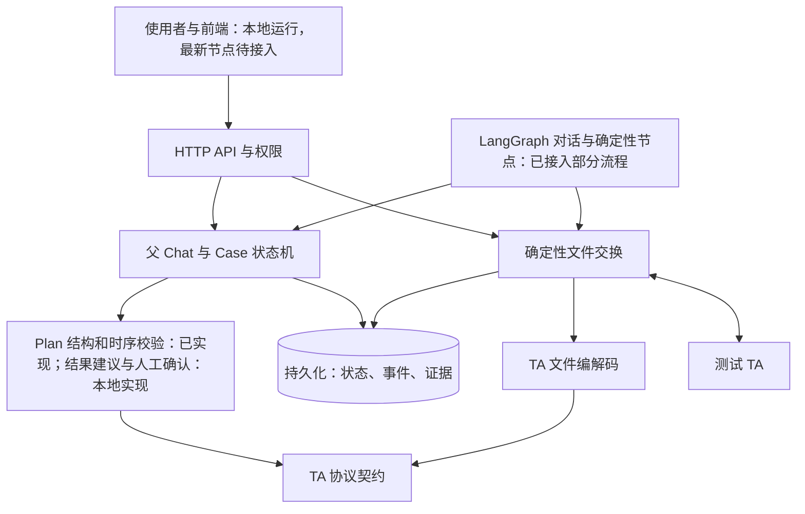
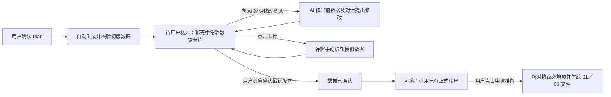
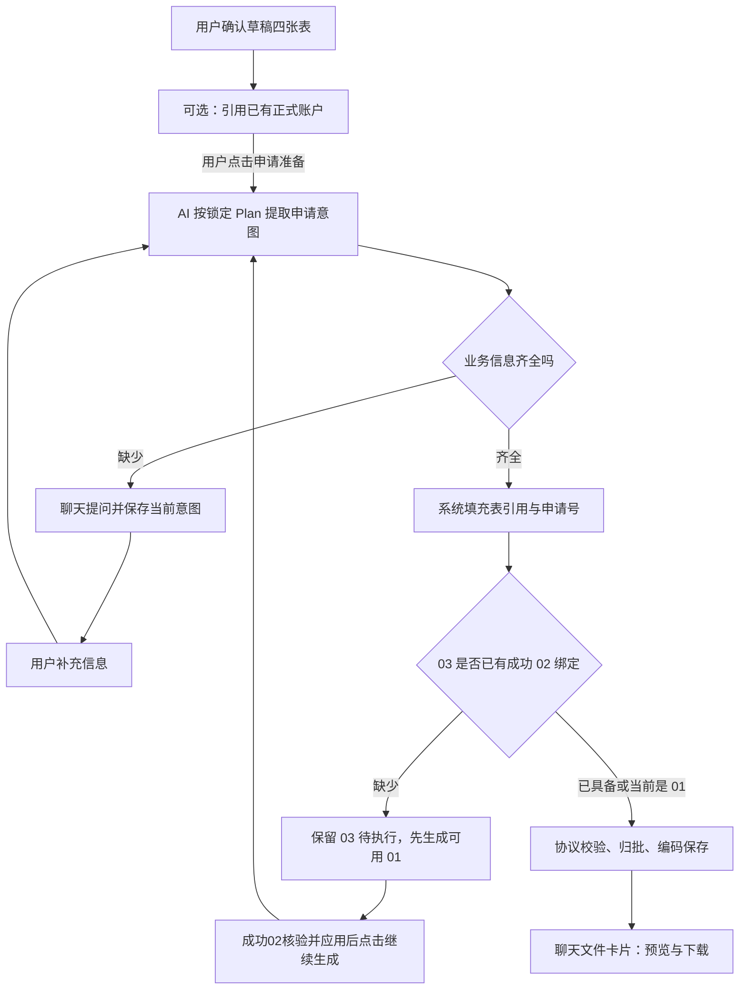

# Case 全流程设计

## 当前有效入口与实现基线（2026-10-06）

本文是 Case／Agent 平台业务流程的主设计入口，以已合并代码为当前事实基线：远端 main `ec29a19d`（PR20／21／22）。一个 Workspace 下有父 Chat，**一个父 Chat 包含多个 Case**；各 Case 独立保存讨论、锁定 Plan、申请和结果。界面可以把父 Chat 显示为项目，把 Case 显示为独立场景对话；界面用语不改变后端父子关系。旧稿中“一个 Chat 就是一个 Case”、独立 Run 统管流程等说法不再作为当前架构。

本文区分已实现、历史 PR 边界和目标设计。后面的历史 PR 介绍只说明当时提交的职责，不代表这些能力现在仍“待提交”；发生变化的当前流程以本节、合并状态表及“当前回传和正式数据流程”“Plan v2”两节为准。接口细节与限制见 [Backend README](../Backend/README.md)，实际运行版本见项目本机 `PROJECT_VERSION_GUIDE.md`。本地页面仍运行 PR21，PR22 的时序 UI 尚未接入；远端源码合并不等于本地页面完成了全部验收。

同名本机旧完整版已保留历史备份，其有效但尚未实现的需求收录于本文末尾目标附录。其他产品调研、三步工作流和 UI 稿是历史设计或前端讨论，不覆盖这里的业务实现事实。每次业务行为或 Plan 格式改变，必须在同一改动中更新本主设计及受影响的接口文档，明确哪些目标仍未实现；不能只更新代码或 README。

## 架构与提交顺序

每个 PR 只加入图中的一层及其直接验收。协议定义先于编解码，编解码先于文件服务；确定性的 Case 业务先于 Agent 接入。图表示目标架构，不表示所有模块已经合并。

## 当前合并状态

| 层 | 状态 | 当前范围及限制 |
|---|---|---|
| TA 协议字段、业务代码与文件类别 | 已合并 PR3 | 协议契约与交换方向 |
| TA 文件编解码与版本配置 | 已合并 PR5 | 2.1／2.2、GB18030、数据及索引编解码 |
| 数据库、身份与隔离 | 已合并 PR6 | Workspace → 父 Chat → 多个 Case |
| 申请、批次与回传归属 | 已合并 PR7，PR21 改为独立确认生效 | 旧 matchReturnRecord 不能直接创建绑定 |
| 首次与后续讨论、Plan 提案、确认、讨论持久化 | 已合并 PR8／9／10／11／12／17 | 服务端 Case 历史、不可变锁定版本；PR22 加文件时序 |
| 数据生成与人工核对 | 已合并 PR18 | 四张草稿表，不能代表正式账户、交易或持仓 |
| 01／03 申请准备及文件生成 | 已合并 PR19／20 | 显式启动申请准备；冻结申请快照与文件；新开户03等待有效02 |
| 02／04 解析、人工交付登记与正式确认 | 已合并 PR21 | 分类型上传；解析与正式应用分开；开户001/101、申购022/122 |
| Plan v2 文件时序及校验 | 已合并 PR22 | exchangePlan、询问时序、发送/解析/应用门槛、多包与历史Plan补齐 |
| 05 接收、解析、持仓同步 | 本地实现，待用户验收 | 独立05接收、原文件保存、Plan时序校验、显式账户余额同步；明细/基金汇总只保存 |
| Case 实际结果读取、建议判定、人工最终确认 | 本地实现，待验收 | 场景预期原文→证据断言→精确比较→建议→人工确认；不等于完整Chat封存与重置流程 |
| Plan严格结构与数据/预期双确认 | 本地实现，待验收 | 提案前生成草稿定义与固定申请内容、结构化断言；同版本两次人工确认后锁定，执行不重新推导 |
| 统一混合02/04/05 ZIP/文件夹接收 | 未实现 | 当前完整混合索引包须分类型处理，不宣称整包自动路由 |
| 全流程 LangGraph checkpoint/interrupt 编排 | 未实现 | 已有独立小图通过数据库与API事件衔接 |
| 前端 | 本地验收 | 业务PR只含后端；最新时序能力还需前端接入 |

## 第一个 PR 的边界：TA 协议契约

第一个 PR 仅定义当前测试流程用到的文件字段、顺序、类型、字节宽度、数值精度、业务代码、必填元数据和交换方向。01、03 是销售侧发往 TA 的申请；02、04、05 是 TA 回传。显式选择交换流时，文件类型必须属于该交换流，避免生成错误的索引前缀。04 的正常确认使用 OFI，提前回报使用 OFF，索引类型由交换流决定。2.2 布局分别有 89、27、82、122、23 个字段；07 基金资料有 86 个字段。这里的“必填”是协议与业务元数据，不能代替后续发送端对具体申请的校验。

第一个 PR 不生成文件、不写数据库、不运行 Case 状态机，也不调用模型。第二个 PR 加入编解码与完整文件往返验证；它直接读取第一个 PR 的定义，避免在服务层另写一套字段清单。

## 第二个 PR：编解码与版本配置

本 PR 叠在协议定义 PR 之上，加入 2.1／2.2 文件结构、GB18030 字节处理、定长字段编解码、数据文件与索引文件的构造、解析与检查，以及按业务含义归一化返回记录。它仍然只是纯文件处理模块，不连接数据库，也不发送或接收网络请求。

2.2 协议字段以本地原件 [中央数据交换平台开放式基金业务数据交换协议 V2.2（2026-03-20）](./protocol/中央数据交换平台开放式基金业务数据交换协议V2.2-20260320.doc) 为核对依据；提取文本与读取器配置只用于辅助定位和交叉检查。

验收以真实字节长度、文件头尾、字段数和顺序、数据与索引往返、错误文件拒绝为准。文件头按 GB18030 编码后的字节数补齐，数值头字段以及 A／N 记录字段在解析时校验，损坏文件整份拒绝。2.1 文件保留原始字节，避免强行转为 2.2 时丢失旧版专有字段；旧式 2.2 版本号对所有已支持的文件类型（包括扩展类型 X1）规范化，原记录保留。下一层的数据库与文件服务才能把这些字节和 Case 证据安全地保存与关联。

## 第三个 PR：身份、Workspace、父 Chat 与 Case 持久化

本 PR 建立用户、会话、Workspace、父 Chat、Case、SOP 版本和 Chat／Case 状态事件表。一个用户拥有一个 Workspace；父 Chat 属于 Workspace，Case 属于父 Chat。后续 Case 可以引用同一父 Chat 内的来源 Case，并限制一个来源 Case 只产生一个直接后续 Case。强制结束的原因、结束时间与状态必须同时满足数据库约束。状态事件在创建 Chat／Case 时与主记录同事务写入；后续状态跳转规则在状态机 PR 实现。

访问入口通过会话解析服务端 Workspace，再限定 Chat 和 Case 查询；客户端不能传入 Workspace ID。这里没有用户可见或业务归属上的 `Run`。本 PR 不创建申请、发文批次或回传，也不提供 HTTP 登录页面；后者在 API 层接入此访问入口。

数据库迁移只面向独立的 `ta_case_agent` 库。每张表建表前先写入步骤记录，MySQL DDL 中断后可按步骤继续；已完成迁移保存源文件 SHA-256，修改旧迁移会被拒绝。运行时须提供 `CASE_DB_NAME`、`CASE_DB_USER`、`CASE_DB_PASSWORD`，并执行 `npm run db:migrate`。该数据库账号需要在部署迁移时拥有建表权限；普通请求使用单独的受限账号由后续服务层接入。

## 第四个 PR：申请、批次与回传归属

本 PR 在父 Chat／Case 基础上增加交换通道、申请快照、发文批次、批次申请、原始文件和逐条回传。申请绑定已锁定的 Case SOP 版本，校验业务必填字段和交易日期，保存当时完整的协议记录及编码字节的摘要；全 Chat 的 Case 均有锁定 SOP 后，才能把同一通道、业务日的就绪申请纳入一个批次。纳入后申请状态变为 `BATCHED`，不能再次归批。批次只属于父 Chat，不属于单个 Case。生成文件、点击“已交付给 TA”及其状态跳转留给后续确定性文件服务。

TA 上传的完整原始文件按 Workspace 和交换通道保存。它可以包含多个 Chat 的记录，因此不能先按当前打开的 Case 裁剪。文件头、文件名、版本、机构和类型须与通道一致，结构错误的文件整份拒绝；同一通道重复上传同一字节不重复生成回传记录，即使改了文件名也一样。同名不同内容拒绝。02／04 回传只有与已交付申请的申请号、相应确认业务代码、类型、机构、交易日期及账户／基金关键字段核对一致，才会关联到该申请及其 Case；已有 TA 账号的 01 申请在匹配 02 时还须核对 TA 账号。这是 PR7 的历史归属设计；当前 PR21 已关闭直接匹配建绑定的旧入口。只有独立核验并显式应用成功02，才建立正式账户和可追溯的交易账号与TA账号绑定；后续 03 和已有 TA 账号的 01 申请在入库前必须使用该 Workspace、通道下已确认的绑定。05 与不匹配的记录保留为未归属证据，后续再对账。归属不等于业务判定，SOP 判定和人工结论仍属于后面的状态机层。

## Agent 第一个对话节点：讨论测试意图

第一个 LangGraph 节点接收使用者的需求描述，先询问使用者想验证什么，并给出 AI 的初步理解及最关键的待确认信息。回复使用 `first-node-format-v4`：三行简短中文纯文本，依次以“想先确认：”“初步理解：”“还需明确：”开头；第一行以中文或英文问号结尾，后两行不限定句末标点；不显示 Markdown 标题、列表或加粗。提示词明确本轮不输出 SOP、测试步骤或测试数据，格式校验会拒绝这些显式段落标签；自然语言语义仍需由使用者审阅，不能仅靠格式校验保证。提示词只规定节点职责和输出格式，不写入某个样例的业务规则或测试方法。节点输出后等待使用者回答；模型原文通过格式检查后原样返回，不由程序改写测试判断。当前只提交可独立调用的图节点与 Sophnet 模型适配，不接入 Chat 事件、数据库或前端。多轮讨论、方案收口、用户确认及锁定 SOP 属于后续节点，不能把这个首次回复当成最终 Plan。

## Agent 后续讨论节点：修订测试方法

使用者回答后，LangGraph 将先前完整的用户与 AI 对话连同新回答交给后续讨论节点。AI 根据最新回答修正理解，提出一项可讨论的测试方法和需要观察的结果，并追问下一步待确认事项。输出继续使用简短三行纯文本：“当前理解：”“建议先测：”“请你确认：”，不把讨论中的建议标为最终 Plan；第三行接受中文或英文问号及其后的简短解释。`followup-discussion-v3` 明确禁止声称助手或系统已经生成、锁定或执行方案，格式校验拦截显式完成声明，同时保留对使用者既往操作的描述；自然语言语义仍需由使用者审阅。提示词只规定节点职责和输出格式，不预设某个样例应采用的边界值、日期算法或其他测试方法。使用者再次补充时，图可以再次进入这个节点，不限制为仅讨论一轮。当前由调用方传入和保存完整对话；正式接入时必须从服务端该 Case 的事件记录读取，不能信任客户端自报的历史。Chat 事件持久化、方案收口、提案及用户确认仍属于后续 PR。

## Agent Plan 提案节点：供使用者审阅

经过至少两轮完整的用户与 AI 讨论后，调用方可以根据使用者明确的提案请求进入 Plan 提案节点。模型按固定 JSON 结构给出测试目标、前提、测试场景、动作、可观察预期、证据和待确认事项；代码校验结构并以纯文本小标题展示。提示词只规定这些通用字段及“不能编造事实、不能自行确认或执行”的边界，不写入某个测试样例。提案状态为待用户审阅，用户提出修改后可继续讨论并重新提案；这一 PR 不锁定 SOP、不写数据库、不启动数据构建。正式确认与持久化属于后续节点。

## Agent 确认与锁定节点：用户审阅 Plan

三份模型提示词（首次询问、后续讨论、Plan 提案）只约束各节点职责和输出结构，不包含当前浮动管理费样例的业务规则、日期或预期结论。Plan 提案仍由 Agent 结构校验；服务端将其存为指定 Workspace／Chat／Case 下的待确认 SOP 版本。用户修改提案并重新提交时，旧待确认版本降为草稿，新提案取得递增版本号。

用户对审阅的版本显式选择“确认”或“修改”。修改只返回讨论，不锁定 SOP；确认节点是确定性 LangGraph 节点，不再请求模型作判断。服务端在同一事务中核实会话与 Workspace 归属、Chat 未结束、Case 正在待确认、所确认的是最新版本且待确认事项已清空，再将 SOP 与 Case 状态锁定，并写入带用户身份的状态事件。确认旧版本或重复确认会被拒绝。新增迁移把 SOP 状态字段扩为 24 字符，以实际容纳 `PENDING_CONFIRMATION`。该独立节点在当时不启动数据构建；后续本地严格Plan流程改为准备数据、预期结果分别确认，第二次确认与初版草稿生成串接，仍保留锁定Plan和写草稿各自的事务边界。草稿确认不再自动启动申请准备，详见下文。

## Case 讨论记录：服务端持有完整历史

每一轮用户输入先作为 `PENDING` Case 讨论记录写入数据库，再调用模型；模型回复通过格式校验后才补全同一轮记录为 `COMPLETE`，附带提示词版本和发起用户。读取与写入都先用登录会话确定 Workspace，再限定父 Chat 与 Case；关闭的 Chat、锁定的 SOP 不能继续讨论。模型失败时用户输入仍在服务端，可用相同输入重试，或显式放弃该轮；未完成回合不送入下一轮模型，也不允许新 Plan 抢先形成。服务层每轮从数据库读取已完成的完整历史，以轮次号防止过期结果覆盖新回复。

待审阅 Plan 后若用户继续讨论，登记用户输入的同一事务就把旧待确认版本降为草稿、Case 返回讨论状态并记录事件；旧 Plan 无法在模型生成期间被确认。用户必须重新生成和确认提案。PR #12 接通首次与后续讨论的服务端历史，不把客户端传来的 `priorTurns` 作为可信历史。数据构建仍在 SOP 锁定之后。

## Plan 提案回合：回复与版本一起保存

使用者要求生成 Plan 时，服务端先登记 `PROPOSE_PLAN` 回合，再从同一 Case 读取至少两轮已完成的讨论交给 LangGraph。模型生成结构化提案并通过通用格式校验后，服务端在同一数据库事务中保存该轮 AI 展示文本、新的待确认 SOP 版本、来源回合号和 Case 状态事件。提案版本可以追溯到具体的用户请求和模型回复；事务失败时这些完成动作不会只成功一部分。模型失败时回合保持待完成，相同输入和相同回合类型可重试，也可显式取消；讨论请求不能借同一段文字接管提案回合。数据库完成入口再次检查回合类型、至少两轮完整讨论、登录归属及 Chat／Case 状态。这个 PR 沿用已有的通用提示词和展示格式，不加入测试样例的业务内容。HTTP API 与 UI 接入留给后续层。

## 目标流程与状态门槛

一个父 Chat 包含多个 Case；每个 Case 与使用者讨论测试目标和可观察标准，形成 SOP 草案。用户确认并锁定 SOP 后，服务按当前父 Chat 的所有 Case 汇总本批 01/03。新账户先发送 01，成功收到 02 和真实 TA 账户后，依赖它的 03 才进入后续批次。系统接收完整 02/04/05 文件，按记录关联到原申请和 Case，依据锁定 SOP 判定 PASS、FAIL、WAITING 或 REVIEW。系统／AI 给出建议，人逐 Case 确认最终结论。

人工确认 Case 测试失败后，在同一个父 Chat 下创建关联的后续 Case。后续 Case 引用原 Case 的 SOP、证据、建议结论和人工失败原因，从讨论新方案开始；用户确认新 SOP 前不自动重发申请。原 Case 保留只读的失败记录。预期中的 TA 业务失败若使测试通过，不创建后续 Case。重复处理同一次人工失败不能创建多个相同后续 Case。

人工可以填写原因**强制结束整个 Chat**，这是独立兜底出口：即使还有失败或未完成的后续 Case，也停止后续发文与 Agent 动作，保存各 Case 当时的真实状态，不把失败或未完成改写为通过。正常结束仍须完成当前后续 Case。当前后端尚未实现关联新 Case 或这个强制出口；数据库与状态机 PR 将按此目标调整。`Run` 不作为用户可见的产品概念。

上述流程是目标设计。它们的代码和测试会在对应层的 PR 中逐项加入，并在本表记录合并状态。

## 数据生成与人工核对节点（2026-10-05 确认）

本节记录已实现的申请草稿准备；草稿写入不是正式销售数据生效。它更新“确认 Plan 后的数据准备”交互；与上文历史 PR 的“确认后不启动数据构建”表述冲突时，以本节为准。第一版只处理客户、交易账户、基金、模拟持有四张表。字段语义和关系由公共提示词说明；每个 Case 的具体值、数量和场景只来自该 Case 已确认的 Plan。四张表是当前实现范围，不宣称覆盖未来所有业务数据。

- 用户点击确认 Plan 时，服务端先让模型生成并校验数据定义；若 Plan 缺少关键输入，此次确认失败，Plan 保持待确认以便修改。校验通过后才锁定 Plan 并自动写入数据；用户无需再点击“执行生成”。锁定后的数据库写入若暂时失败，可以对同一版本重试，成功写入保持幂等。
- 初版数据写入后仍是**待核对**，不能将 Case 提前标为文件执行中。AI 在 Chat 中请用户核对数据；数据卡片在整个核对阶段持续可见，始终打开同一批数据的最新版本。卡片中的表格展示四张物理表、全部字段和记录。
- 用户可在聊天中反复说明修改意见，也可从卡片打开编辑弹窗手动调整。每次修改保留版本与历史，再回到待核对；并发修改必须核对最新版本，避免覆盖别人的更改。AI 的修改受字段格式、关联关系、Workspace/Chat/Case 归属和数据库约束限制，不接受模型自报的确认状态。
- 只有登录用户对**当前数据版本**明确确认后才记录确认人、版本与时间；此后禁止静默修改。生成初版、AI 回复或手动保存都不能代替这一步。已有数据仍只是本地模拟值，不能冒充 TA 返回的账号或持仓。
- 所有 Case 均须完成数据生成与人工确认后才能进入申请和发文批次；既有只确认 Plan、尚未生成数据的 Case 也须先补齐这一步。前端仅供本地验收，GitHub PR 不包含前端源代码。

## 01／03 申请文件节点（2026-10-05）

已确认四张表是客户、交易账户和基金的来源，不能直接充当完整的 TA 申请：01 还要求证件类型与证件号，03 还要求具体业务代码、申请金额或份额等。用户确认草稿后可先选择已有正式账户；用户显式点击申请准备，节点才读取当前 Case 的锁定 Plan、四张表、通道和成功 02 绑定，由模型提取申请意图。公共提示词说明引用、协议和信息缺失规则，具体业务来自当前 Plan；支持的业务与字段长度由协议目录提供。证件、金额、份额、费率、日期和时间缺失时，在聊天中询问用户，不从余额或净值推算。服务端填充申请号、账户、客户、网点、基金和 TA 绑定，模型不能覆盖这些系统字段。

01开户申请可按已确认的草稿账户逐条准备；草稿账户不等于TA已确认正式账户。03 申请必须引用同一 Workspace、通道下由成功且已匹配的 02 回传建立的 TA 账号绑定；没有绑定时不能入库。父 Chat 的所有 Case 均锁定 Plan 且确认数据后，就绪申请才能组成发文批次。批次从冻结的申请快照编码出 GB18030 的 01／03 原始文件，保存文件名、字节、摘要与记录数；重复生成同一批次返回已存文件，页面可按字段预览和下载。状态依次为申请 `READY → BATCHED → GENERATED`、批次 `DRAFT → GENERATED`。

本节点只生成和保存申请文件，不宣称已交付 TA，也不把模拟账户视作 TA 账号。人工交付登记、02／04解析和确认生效入口已在PR21加入；当前申请生成仍未提供完整OFI索引交付能力，05独立入口已在本地实现（见05同步约定）。回传若自带原始OFI，按当前解析支持范围核验。03 意图缺少成功 02 绑定时保留待执行，当前可生成的 01 文件先保存；绑定到达后点击继续生成可生成 03。已经入库的申请意图冻结，补充对话只能完善未入库的内容。每个 Case 的补充历史和意图持久化并检查版本；申请号由 Case、通道和稳定意图键确定，重试复用原申请和文件。

申请准备状态独立于四张表确认状态：`NOT_STARTED → PREPARING → NEEDS_INPUT / WAITING_TA / WAITING_CHAT / GENERATED / NO_APPLICATION`。模型或文件生成失败不会撤销已经确认的数据；页面显示错误并提供继续生成。保存版本冲突时要求刷新。尚在 `PREPARING` 的中断任务只能先恢复原意图，不能在部分申请入库时改写内容。四张数据表和公共数据展示在此阶段仍保持已确认的内容。

普通“继续生成”会重新读取完整 Plan、已确认数据和最新 02 绑定，再提取意图，以补回此前模型遗漏的后续申请。仅 PREPARING 中断恢复复用已保存意图。未选通道时提交的补充信息先持久化，选择通道后交给模型，成功处理后清除。历史保留最近至多 20 轮且至多 64KB，通过 turnsOmitted 记录省略轮数；总状态仍受 240KB 限制，已冻结意图与文件不因历史裁剪而删除。

当文件生成因 FILE_SEQUENCE_EXHAUSTED 失败时，申请准备进入 WAITING_OPERATION，保存错误及冻结意图，先由通道维护人员处理当日文件编号容量，再重试原批次；不得通过补充对话改写已入库申请或静默换日期。其余异常仍按 PREPARING 中断恢复处理。

## 当前回传和正式数据流程（PR21，已实现）

生成的 `case_generated_*` 是申请草稿和测试条件，确认草稿只表示允许准备申请。正式查询 `GET /api/sales-data` 读取独立的 `sales_confirmed_accounts`、`sales_confirmed_transactions`、`sales_confirmed_holdings`；模拟余额和持有不能自动复制进去。

1. 准备并生成01／03；用户实际交付给TA后，调用 `POST .../return-confirmation/delivery` 登记交付，申请进入等待回传。
2. 用户分别调用 `POST .../return-parsing/02`、`.../04` 上传原始文件。格式校验和解析保存原件、摘要、全部字段与来源位置，**解析本身不更新正式数据**。完整混合02/04索引包当前不支持；同类型OFI包必须提供全部索引声明文件。
3. 用户调用 `POST .../return-confirmation/apply`，提供 `parseId` 和 `recordIndexes`。后端核验本次申请号、机构、日期、业务码以及账户/基金等关键字段；上传时所处Case只是操作上下文，不能替代业务归属验证。
4. 成功开户 `01/001 → 02/101` 才建立正式账户与TA绑定；成功申购 `03/022 → 04/122` 按实际确认金额和 `ConfirmedVol` 保存交易；没有05基准时增加持仓，有基准时仅增加基准日期之后的交易，避免重复计入。有效匹配的TA业务失败保留返回码、原因并标记申请FAILED，不修改正式账户/持仓。尚未最终完成的确认、错误归属或不支持业务不生效。
5. 重复确认幂等；不同确认不能覆盖旧结果；单个应用请求有错误则整个事务回滚。既有正式账户可由 `POST .../return-confirmation/account` 引用到尚未生成申请的Case，直接准备03而不重复开户。

旧 `matchReturnRecord` 一律返回 `CONFIRMATION_SERVICE_REQUIRED`；不可恢复直接匹配建绑定的旁路。历史测试数据与旧绑定不会自动提升为正式数据。当前没有定义资金现金会计，也没有实现赎回、冻结/解冻、销户等其他业务的会计效果；05账户余额快照同步已在本地实现。

实际LangGraph节点包含：等待/解析 `wait_account_return`、`parse_account_return`、`wait_transaction_return`、`parse_transaction_return`；核验/应用 `verify_account_return`、`apply_account_confirmation`、`verify_transaction_return`、`apply_transaction_confirmation`；时序 `validate_exchange_order`；本地新增05 `wait_holdings_return`、`parse_holdings_return`、`verify_holdings_return`、`sync_holdings_snapshot`。协议字节解析和数据库更新由确定性服务执行，不由AI猜测错位字段或编造成功。

## Plan v2 文件时序与当前格式（PR22，已实现）

Plan固定字段为 `objective`、`preconditions`、`scenarios`、`openQuestions`、`exchangePlan`。每个scenario包含 `title`、`setup`、`action`、`expected`、`evidence`。展示顺序为测试目标、准备条件、各场景的准备/动作/预期/证据、待确认问题、文件步骤/时序问题，最后请用户审阅。

`exchangePlan` 必须包含 `status`、`steps`、`openQuestions`。UNPLANNED必须没有steps且有待确认问题；READY必须有steps且没有时序待确认问题。每个step的固定字段：

| 字段 | 当前含义 |
|---|---|
| stepId / roundId | 唯一步骤标识与对应申请轮次标识 |
| direction / fileType | SEND只能01/03；RECEIVE只能02/04/05 |
| businessTime | `{kind: DATE或RELATIVE, value: YYYYMMDD或用户确认的相对时点}` |
| required | 是否必需的布尔标记；当前不等于已经实现结果判定的证据齐全门槛 |
| dependsOn | `[{stepId, condition: SENT或PARSED或CONFIRMED}]`，无环依赖 |

02／04必须依赖同轮次01／03的SENT。模型提示要求新开户的03依赖02的CONFIRMED；正式账户前置核验仍独立强制，不能由Plan绕过。已有账户可直接03；05可以独立或可选，不强制02<04<05，不限制只有两轮。

模型提出的时间必须有用户肯定且指向对应文件的对话证据；举例、疑问、否定或较新改期不能沿用旧时间。未知时序进入真实LangGraph `ask_exchange_timing` 节点追问，重新提案；只有READY且待确认问题清空才允许锁定。DATE核对批次业务日或文件头日期，RELATIVE保存已确认描述；实际顺序依赖dependsOn，不按时间戳排序，不提供T+N日历计算或定时调度。

`validate_exchange_order` 在发送、受控02／04／05上传、确认生效时执行。SENT表示用户登记实际发送；PARSED表示格式正确且时序通过；CONFIRMED表示对应Case/批次/申请类型全部成功确认，TA业务失败不满足它。一个接收step可接收同批多个包，重复包幂等，多Case混合01／03批次发送前核验全部成员，任何失败都不部分发送。

02／04乱序格式正确包保留原件及解析结果，返回HTTP409 `ORDER_VIOLATION`、`ORDER_REJECTED`和parseId，不记录步骤完成、不生效；补齐依赖后必须显式重传。05乱序上传返回明确异常且不登记接收或修改正式数据，用户补齐前置后重新上传。多个同类型轮次无法唯一确定时需 `exchangeStepId`。历史锁定Plan缺时序时通过 `POST .../exchange-plan/confirm` 显式提交baseVersionNumber、exchangePlan、mappings，生成不可变的新锁定版本，保持旧目标/场景/申请/草稿引用，并审计映射；不偷偷猜测或重写旧计划。

**旧Plan格式的限制：** 历史expected和evidence为非空单行文字，旧已锁定Case继续使用原文提取断言并人工核对完整性。新提案增加下面的严格contract；不静默为旧Plan补确认或推导未知预期。

## Plan 严格数据定义与结果预期补丁（本地实现，待用户验收）

2026-10-06用户授权实施。新提案先运行LangGraph `define_plan_data → define_plan_expectations → validate_plan_applications`，然后将最终展示文字和完整结构同事务保存。确认阶段是 `confirm_plan_data` 与 `confirm_plan_expectations` 两个确定性节点，依次等待显式API事件。当前仍为数据库/API连接的小图，不宣称已接入原生checkpoint/interrupt全图。准备数据节点显式使用reasoning_effort=low，结构化预期映射节点使用thinking.type=disabled，模型仍为Sophnet DeepSeek-V4-Pro-0813；其他调用保持原默认配置。参数依据[DeepSeek官方思考模式文档](https://api-docs.deepseek.com/guides/thinking_mode/)，Sophnet兼容性以实际验收结果为准。

保留objective、preconditions、scenarios、openQuestions、exchangePlan，新增contract：

- version为1；protocolVersion明确为22。当前严格申请预校验与执行限定V2.2，旧流程和已有协议版本能力不因此自动扩大。
- dataSpecification包含customers、accounts、funds、holdings、missing：沿用草稿字段与索引规则；新增账户由系统分配交易账号，不能假装已经成功开户。正式状态仍只在TA回传成功且用户确认应用后改变。
- applications逐项固定key、SEND stepId、businessCode、accountIndex或已有transactionAccountId、fundIndex与协议fields；当前固定开户001和申购022。金额、基金、证件及申请时间在确认前展示；日期来自明确DATE步骤。相对发文日期、关键字段缺失或不支持的业务必须先澄清。新账户03必须依赖该账户01对应的02成功CONFIRMED，已有正式账户允许直接03。
- assumptions明确业务假设。净值、费用、舍入、初始状态或确认规则不明确时不得从申请金额猜TA确认结果，列入missing。
- expectations包含scenarioIndex、expectedQuote、source、selector、field、operator、expectedValue。source限申请确认、正式账户、当前正式持仓；selector精确指定新准备账户索引或已有交易账号，可指定通道；持仓必须指定基金与类别，申请确认必须指定文件类型与业务日期。operator支持eq/gte/lte；非数值仅eq。数值expectedValue必须在expectedQuote中明确对应本字段；场景/基金编号以及其他余额数值不构成依据，缺少明确对应时拒绝formatter输出。每个场景至少有一项断言，仍需人工检查语义是否完整覆盖，代码不宣称能证明自然语言完整性。
- missing是预期或申请中的待澄清条件。准备数据缺条件不能确认DATA；全部待澄清项、文件时序和场景问题清空后才能确认EXPECTATIONS。

`POST .../plan/confirm`请求必须为 `{versionNumber,section:"DATA"或"EXPECTATIONS"}`。DATA同事务核验最新版并保存actor/时间，保持SOP_PENDING且不写草稿。EXPECTATIONS要求同版本已有DATA确认，再保存第二次确认并锁定。`case_plan_section_confirmations`以Workspace/Chat/Case/版本/section为主键，重复DATA幂等；新版不继承旧版确认，旧版确认保留审计。GET Plan返回本版本confirmations。

锁定后草稿执行与重试直接使用保存的dataSpecification，不再调用模型推导；数据库拒绝不一致定义。申请准备也使用保存的applications，系统仅填充确定的账号、申请号、TA绑定与通道，不重新选择金额/基金。草稿与申请业务内容冻结；未锁定时通过继续讨论生成新版本并重新确认，已锁定后业务修改须新建Case，原申请与历史证据保留。旧待确认Plan无contract时不能新锁定，需要重新提案；旧已锁定Plan按原流程继续。

结果图对新contract逐项查找唯一匹配证据，用精确十进制定量比较，不调用模型重解释已确认值。必需步骤未完成为WAITING，证据缺失或不唯一为REVIEW，差异为FAIL，全部断言一致为PASS建议；最终仍须人工确认。历史自由文本Plan保留上一版模型提取逻辑。本次没有实施任意关系表达式、跨字段公式或TA账号未知时的“非空且相等”运算；这些预期需澄清成当前支持的可核验字段或另票扩展。

## 尚未实现的完整流程目标（保留原设计需求）

以下保留本机旧完整版的有效需求；它们不是当前已有接口或已验收功能。父Chat多Case为当前已确认结构，旧稿一Chat一Case及Run结构不再适用。

- **可观察成功标准与本次结果：** 锁定Plan需明确风险假设、前置TA状态、每笔动作、具体预期字段/值/范围、异常与反证、共享账户影响及必需/辅助证据。未来读取本Case的本次申请结果和相关正式数据库状态进行核对，保留原始记录来源；不能仅因数据库中已有一个历史账户或持仓就认为本次测试成功。本地strict contract已提供准备数据和具体字段/值/范围；跨字段关系、共享账户变化的因果证据与语义完整性仍需后续扩展，不能把最低结构校验视为完整业务证明。
- **统一完整回传包：** 目标为一次上传ZIP、单文件或文件夹，完整保留02/04/05和原始索引，按申请与账户级关系关联记录，不要求用户按Case拆文件。当前02/04分类型解析尚未达到这个入口；多包幂等不等于混合包支持。
- **05参与Case判断：** 独立05上传、解析、持仓快照同步、日期校验及与04重复计入保护已实现，详见下文实现约定。后续需按锁定Plan决定是否参与Case判断，同一账户证据可能服务多个Case；不需要05的Case不应被它阻塞。当前尚未实现05参与结果判断。
- **建议结论与人工终判：** 目标结论为测试通过、测试失败、等待回传、证据不足/人工核对。证据齐全且不符锁定标准应建议失败，不能临时改标准；TA业务失败可能符合预期并测试通过。AI建议保留依据和版本，用户逐Case确认才完成，修改须保存理由、证据、身份和时间。建议判定、人工终判/封存接口当前均未实现。
- **测试生命周期：** 明确区分父Chat、Case、发文批次与未来测试轮次；新开户可先01后03，已有账户03可与其他Case新开户01同批。人工失败的关联后续Case、正常结束/强制结束、执行中新增Case限制及全部人工封存后开启新测试轮次的门槛，尚未形成完整当前执行流程，需单独设计并与已确认父子结构对齐。
- **共享数据与TA重置：** 目标允许显式复用正式账户，模拟/申请草稿与TA正式数据分开。普通新Case不自动清空正式状态；偶发TA全系统重置应有独立、可审计的流程，保留历史证据，不能暗中重置或继续使用已失效账户。全局重置功能尚未实现。
- **全流程编排：** 已实现独立LangGraph小图，使用持久化业务表与API事件恢复等待；尚未把完整讨论→申请→回传→判定→人工封存接成原生checkpoint/interrupt大图。保留完整循环目标，不能把小图结束等同于整个Case完成。

历史视觉稿、布局稿与旧工作树实现盘点保留在本机备份及相关历史MD；它们用于回顾，不能当作新版业务实现基线。后续业务PR应逐条更新本节状态，并同时补对应验收与接口文档。

## 05 回传同步实现约定（本次开发）

05同步PR只补齐数据同步，02／04保留确认后生效机制。后续结果判断和Plan严格格式补丁在各自独立本地提交中实现，详见对应章节。05 独立上传，不需要伪造 01／03 批次；按已锁定 exchangePlan 的 RECEIVE/05 步骤、业务日期和依赖校验，解析成功登记 PARSED。原文件和每条记录保留；用户点击同步后整包核验并原子落库。LangGraph 路径为等待持仓回传 → 解析持仓回传，以及核验持仓回传 → 同步持仓快照，失败明确返回并回滚。

依据中登 V2.2 表73，DetailFlag=0 是账户余额；WholeFlag=0 的增量传输不表示份额差量，该行总份数仍为余额。DetailFlag=1 明细、A 基金汇总只保存并明确不应用，不覆盖账户余额。只更新上传包明确列出的已正式确认账户、基金、收费方式；缺失账户不凭05创建，不删除或清零未出现的持仓。记录必须完整、机构及账户网点匹配、日期有效、数量非负且可用与冻结不超出总份数。重复账户余额键拒绝整包。

05 按确认日期保存持仓基准和原始来源；余额为基准加已确认的基准日期之后交易。旧于已同步基准的05拒绝，同日不同余额拒绝并要求单独更正，同日相同快照幂等。04 同日或早于05基准仅记录交易，不再增加已涵盖份额；晚于基准增加余额并清除不再代表当前值的可用／冻结展示值。采用相同通道锁串行化04与05，避免重复计入及并发覆盖。05解析／同步不是 Case PASS／FAIL。

## Case结果建议与人工确认（本次本地开发）

该结果判断PR最初只读取已同步数据并给出建议，不修改销售数据。后续本地Plan补丁已扩展为直接消费已确认contract，详见上文。LangGraph为 collect_case_results → compare_case_expectations → explain_case_result → wait_case_result_confirmation。收集当前锁定Plan、当前Case申请/TA确认、05接收/同步状态，以及该Case引用的正式账户和当前持仓；不把整个Workspace数据交给模型。证据带稳定id、原始申请/解析来源，并保存不可变快照与摘要。

模型将scenario.expected原文解释为带原文引用、证据id、字段、比较运算符和预期字面值的断言。后端验证引用与值来源：每个数值必须紧邻对应字段名称，不使用场景编号或基金代码充当数量，不允许总份额、可用或冻结互换；再精确比较数值；模型不直接决定PASS/FAIL。每个场景必须有可核验断言，无法完整覆盖或语义模糊必须REVIEW。required步骤或申请/05同步未完成是WAITING；有具体差异是FAIL；全部断言一致仅为PASS建议，人工仍须核对断言是否完整覆盖自然语言预期。当前自由文本Plan无法自动证明语义覆盖完整，这是待办Plan结构强化的边界，不宣称已消除。

建议持久化，不自动改变Case状态。人工确认需reviewId、PASS/FAIL和核对说明；只能确认最新且证据未变的版本，WAITING/REVIEW不可封存。模型调用在事务之外；保存和最终确认重新读取并核对证据摘要，确认持锁读取以避免并发销售数据变化。本轮审查补齐05原始文件source查询的FOR UPDATE，使它与其余保存/确认取证查询一样使用current read，避免会话鉴权早先建立的REPEATABLE READ快照读取旧原件。最终结论和确认人/时间/说明持久化，Case进入PASS/FAIL，重复同一确认幂等且不能覆盖。
