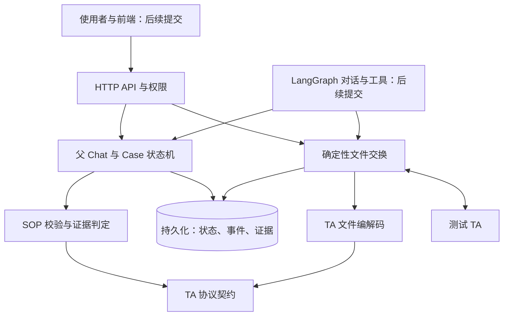

# Case 全流程设计

## 架构与提交顺序

每个 PR 只加入图中的一层及其直接验收。协议定义先于编解码，编解码先于文件服务；确定性的 Case 业务先于 Agent 接入。图表示目标架构，不表示所有模块已经合并。

## 当前合并状态

| 层 | 状态 | 下一层依赖它的原因 |
|---|---|---|
| TA 协议字段、业务代码与文件类别 | 已合并（PR #3） | 编解码、申请校验和 SOP 需要共同的字段含义 |
| TA 文件编解码与版本配置 | 已合并（PR #5） | 文件服务必须读写同一协议布局 |
| 数据库、身份与隔离 | 已合并（PR #6） | 文件、Case 和 Agent 状态需要可信的持久化边界 |
| 申请、批次与回传归属 | 本 PR（#7）：持久化与归属入口 | Case 的证据必须来自真实的确定性流程 |
| 确定性文件生成、交付与完整索引核验 | 待提交 | 把本 PR 的申请与批次变成可交付 TA 的文件，并记录交付门槛 |
| SOP、Case 状态与人工处置 | 待提交 | Agent 必须遵守已确认的计划和状态门槛 |
| Agent 事件与 LangGraph 适配 | 待提交 | 在确定性业务之上提供提问、建议与执行协助 |
| 前端 | 待提交 | 呈现状态与操作；本轮不上传 |

## 第一个 PR 的边界：TA 协议契约

第一个 PR 仅定义当前测试流程用到的文件字段、顺序、类型、字节宽度、数值精度、业务代码、必填元数据和交换方向。01、03 是销售侧发往 TA 的申请；02、04、05 是 TA 回传。显式选择交换流时，文件类型必须属于该交换流，避免生成错误的索引前缀。04 的正常确认使用 OFI，提前回报使用 OFF，索引类型由交换流决定。2.2 布局分别有 89、27、82、122、23 个字段；07 基金资料有 86 个字段。这里的“必填”是协议与业务元数据，不能代替后续发送端对具体申请的校验。

第一个 PR 不生成文件、不写数据库、不运行 Case 状态机，也不调用模型。第二个 PR 加入编解码与完整文件往返验证；它直接读取第一个 PR 的定义，避免在服务层另写一套字段清单。

## 第二个 PR：编解码与版本配置

本 PR 叠在协议定义 PR 之上，加入 2.1／2.2 文件结构、GB18030 字节处理、定长字段编解码、数据文件与索引文件的构造、解析与检查，以及按业务含义归一化返回记录。它仍然只是纯文件处理模块，不连接数据库，也不发送或接收网络请求。

2.2 协议字段以本地原件 [中央数据交换平台开放式基金业务数据交换协议 V2.2（2026-03-20）](./protocol/中央数据交换平台开放式基金业务数据交换协议V2.2-20260320.doc) 为核对依据；提取文本与读取器配置只用于辅助定位和交叉检查。

验收以真实字节长度、文件头尾、字段数和顺序、数据与索引往返、错误文件拒绝为准。文件头按 GB18030 编码后的字节数补齐，数值头字段以及 A／N 记录字段在解析时校验，损坏文件整份拒绝。2.1 文件保留原始字节，避免强行转为 2.2 时丢失旧版专有字段；旧式 2.2 版本号对所有已支持的文件类型（包括扩展类型 X1）规范化，原记录保留。下一层的数据库与文件服务才能把这些字节和 Case 证据安全地保存与关联。

## 第三个 PR：身份、Workspace、父 Chat 与 Case 持久化

本 PR 建立用户、会话、Workspace、父 Chat、Case、SOP 版本和 Chat／Case 状态事件表。一个用户拥有一个 Workspace；父 Chat 属于 Workspace，Case 属于父 Chat。后续 Case 可以引用同一父 Chat 内的来源 Case，并限制一个来源 Case 只产生一个直接后续 Case。强制结束的原因、结束时间与状态必须同时满足数据库约束。状态事件在创建 Chat／Case 时与主记录同事务写入；后续状态跳转规则在状态机 PR 实现。

访问入口通过会话解析服务端 Workspace，再限定 Chat 和 Case 查询；客户端不能传入 Workspace ID。这里没有用户可见或业务归属上的 `Run`。本 PR 不创建申请、发文批次或回传，也不提供 HTTP 登录页面；后者在 API 层接入此访问入口。

数据库迁移只面向独立的 `ta_case_agent` 库。每张表建表前先写入步骤记录，MySQL DDL 中断后可按步骤继续；已完成迁移保存源文件 SHA-256，修改旧迁移会被拒绝。运行时须提供 `CASE_DB_NAME`、`CASE_DB_USER`、`CASE_DB_PASSWORD`，并执行 `npm run db:migrate`。该数据库账号需要在部署迁移时拥有建表权限；普通请求使用单独的受限账号由后续服务层接入。

## 第四个 PR：申请、批次与回传归属

本 PR 在父 Chat／Case 基础上增加交换通道、申请快照、发文批次、批次申请、原始文件和逐条回传。申请绑定已锁定的 Case SOP 版本，校验业务必填字段和交易日期，保存当时完整的协议记录及编码字节的摘要；全 Chat 的 Case 均有锁定 SOP 后，才能把同一通道、业务日的就绪申请纳入一个批次。纳入后申请状态变为 `BATCHED`，不能再次归批。批次只属于父 Chat，不属于单个 Case。生成文件、点击“已交付给 TA”及其状态跳转留给后续确定性文件服务。

TA 上传的完整原始文件按 Workspace 和交换通道保存。它可以包含多个 Chat 的记录，因此不能先按当前打开的 Case 裁剪。文件头、文件名、版本、机构和类型须与通道一致，结构错误的文件整份拒绝；同一通道重复上传同一字节不重复生成回传记录，即使改了文件名也一样。同名不同内容拒绝。02／04 回传只有与已交付申请的申请号、相应确认业务代码、类型、机构、交易日期及账户／基金关键字段核对一致，才会关联到该申请及其 Case；已有 TA 账号的 01 申请在匹配 02 时还须核对 TA 账号。成功且匹配的 02 才能建立可追溯的交易账号与 TA 账号绑定；后续 03 和已有 TA 账号的 01 申请在入库前必须使用该 Workspace、通道下已确认的绑定。05 与不匹配的记录保留为未归属证据，后续再对账。归属不等于业务判定，SOP 判定和人工结论仍属于后面的状态机层。

## 目标流程与状态门槛

一个父 Chat 包含多个 Case；每个 Case 与使用者讨论测试目标和可观察标准，形成 SOP 草案。用户确认并锁定 SOP 后，服务按当前父 Chat 的所有 Case 汇总本批 01/03。新账户先发送 01，成功收到 02 和真实 TA 账户后，依赖它的 03 才进入后续批次。系统接收完整 02/04/05 文件，按记录关联到原申请和 Case，依据锁定 SOP 判定 PASS、FAIL、WAITING 或 REVIEW。系统／AI 给出建议，人逐 Case 确认最终结论。

人工确认 Case 测试失败后，在同一个父 Chat 下创建关联的后续 Case。后续 Case 引用原 Case 的 SOP、证据、建议结论和人工失败原因，从讨论新方案开始；用户确认新 SOP 前不自动重发申请。原 Case 保留只读的失败记录。预期中的 TA 业务失败若使测试通过，不创建后续 Case。重复处理同一次人工失败不能创建多个相同后续 Case。

人工可以填写原因**强制结束整个 Chat**，这是独立兜底出口：即使还有失败或未完成的后续 Case，也停止后续发文与 Agent 动作，保存各 Case 当时的真实状态，不把失败或未完成改写为通过。正常结束仍须完成当前后续 Case。当前后端尚未实现关联新 Case 或这个强制出口；数据库与状态机 PR 将按此目标调整。`Run` 不作为用户可见的产品概念。

上述流程是目标设计。它们的代码和测试会在对应层的 PR 中逐项加入，并在本表记录合并状态。
